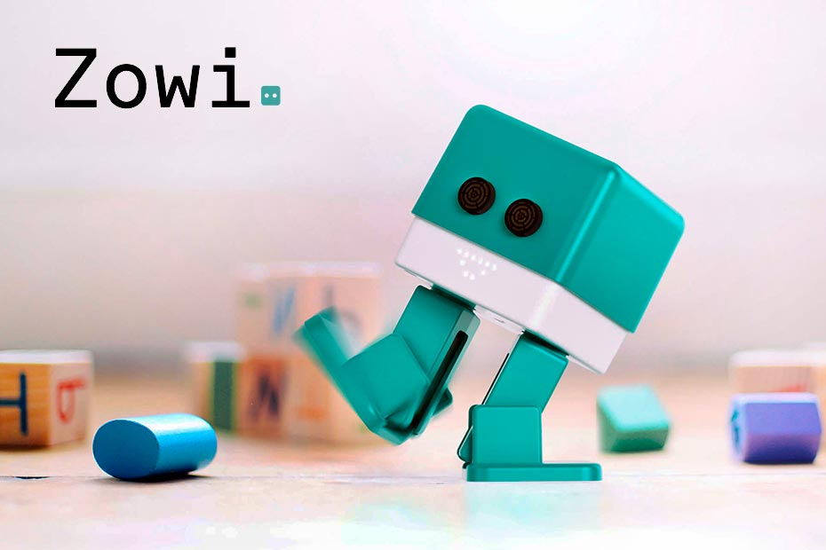
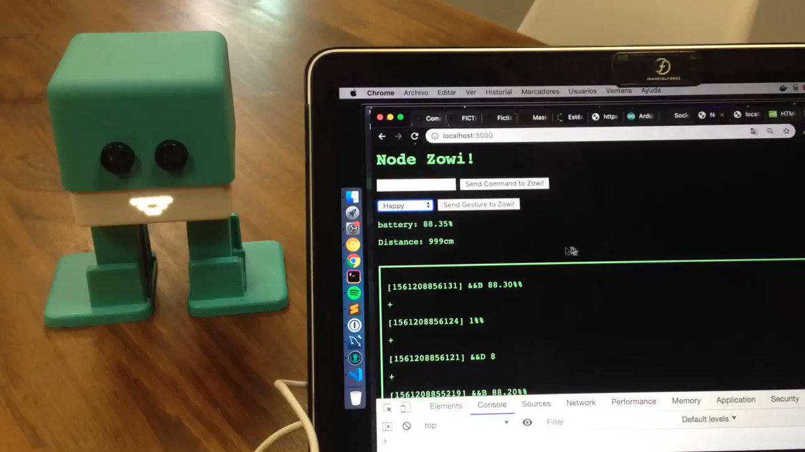
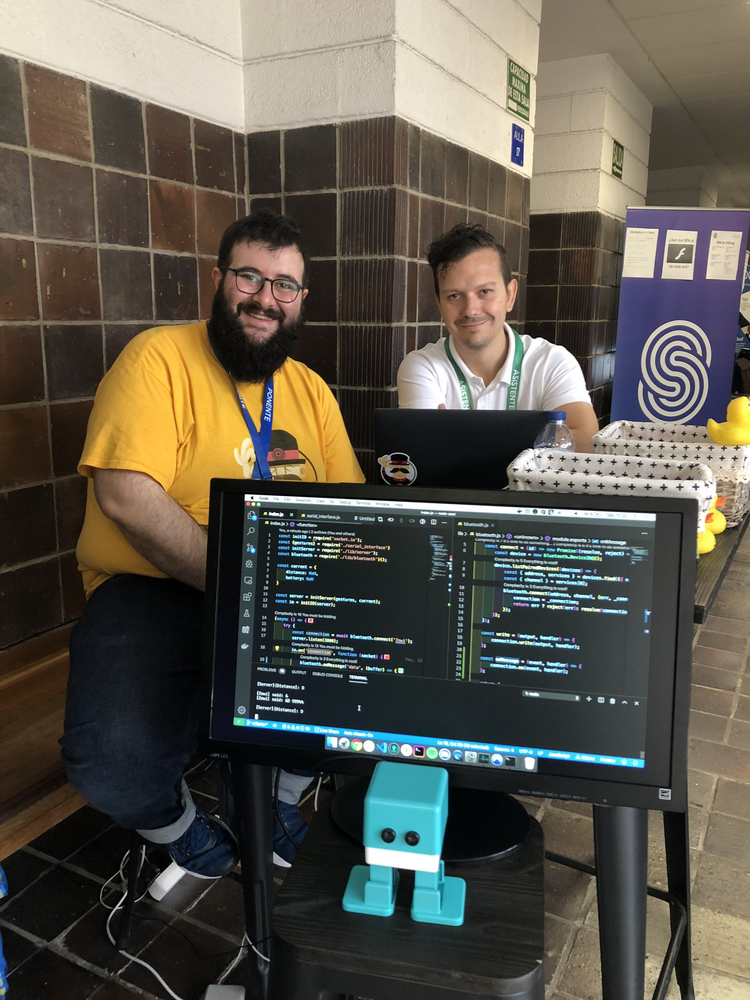

<p align="center"><h1 align="center">
  node-zowi
</h1>

<p align="center">
  Nodejs wrapper for [BQ Zowi Robot](https://www.xataka.com/analisis/probamos-zowi-un-robot-con-cerebro-arduino-que-puede-dar-mas-de-lo-que-aparenta)
</p>

<p align="center">
  <a href="https://www.npmjs.org/package/node-zowi"></a>
  <a href="https://www.npmjs.org/package/node-zowi"></a>
  <a href="https://www.npmjs.org/package/node-zowi"></a>
  <a href="https://snyk.io/test/github/ulisesgascon/node-zowi"></a>
</p>


<p align="center">
  
</p>

<p align="center">
  Thanks <a href="https://github.com/kooltheba">Teba Gómez</a> and <a href="https://github.com/feliun">Felipe Polo</a> my amazing students for your support 😊
</p>

</p>


# About

Nodejs wrapper for [BQ Zowi Robot](https://www.xataka.com/analisis/probamos-zowi-un-robot-con-cerebro-arduino-que-puede-dar-mas-de-lo-que-aparenta)


## ❤️ Awesome Features:


- Out of the box simple Interface. 🔥
- USB Support (including auto-port selection) 🍺
- Commands library mapped out (gestures, sounds, buzzer, movements...)  🎉
- Direct support to listen Bus communications 🔊
- General information available with a configurable interval (distance, noise, battery level...) 👾
- `debug` is supported 💪
- Refresh time is customizable 🧐
- Easy to use and great test coverage ✅


## Installation

```bash
npm install node-zowi
```

## Usage
```js
const zowi = require('./lib')()

;(async () => {
  const { commands } = zowi
  const { getHealth, onClaim, obey } = await zowi.start({ checkVitals: true })

  // Let's check the health in 5 segs
  setTimeout(() => {
    console.log('Health:', getHealth())
  }, 5000)

  // Log all the messages from the serial comms
  onClaim(console.log)

  // Let's send some commands
  await obey(commands.buzzer.tone(3000, 1000))
  console.log('Sent Tone Request!')

  await obey(commands.sounds.ohOoh2())
  console.log('Sent OhOhh Sound Request!')

  await obey(commands.gestures.superHappy())
  console.log('Sent Gesture Request!')
})()
```


## Making off :muscle:

This project was under development for a very long time across engineering clasess with my students and software events.

Finally I managed to finish the library and publish a solid initial version.

#### Fictizia Master'19



_[Full video](https://twitter.com/KoolTheba/status/1142429134750191617)_

#### JsDayCanarias 2019 



## Built With

Development only:

- [Standard](https://www.npmjs.com/package/standard) - Linting propuses
- [Husky](https://www.npmjs.com/package/husky) - Git Hooks
- [commitlint](https://www.npmjs.com/package/@commitlint/cli) - Linting commit messages
- [jest](https://www.npmjs.com/package/jest) - Testing
- [standard](https://www.npmjs.com/package/standard) - Linting
- [standard-version](https://www.npmjs.com/package/standard-version) - Manage changelog and releases

Production only:

- [debug](https://www.npmjs.com/package/debug) - Debug the app
- [serialport](https://www.npmjs.com/package/serialport) - Access serial ports with JavaScript
- [@serialport/parser-readline](https://www.npmjs.com/package/@serialport/parser-readline) - Transfirmation

## Contributing

Please read [CONTRIBUTING.md](CONTRIBUTING.md) for details on our code of conduct, and the process for submitting pull requests to us.

## Versioning

We use [SemVer](http://semver.org/) for versioning. For the versions available, see the [tags on this repository](https://github.com/ulisesGascon/node-zowi/tags).

## Authors

- **Ulises Gascón** - Initial work- - [@ulisesGascon](https://github.com/ulisesGascon)

See also the list of [contributors](https://github.com/ulisesGascon/node-zowi/contributors) who participated in this project.

## License

This project is licensed under the GNU AGPL3.0 License - see the [LICENSE.md](LICENSE.md) file for details

## Acknowledgments

- This project is under development, but you can help us to improve it! We :heart: FOSS!